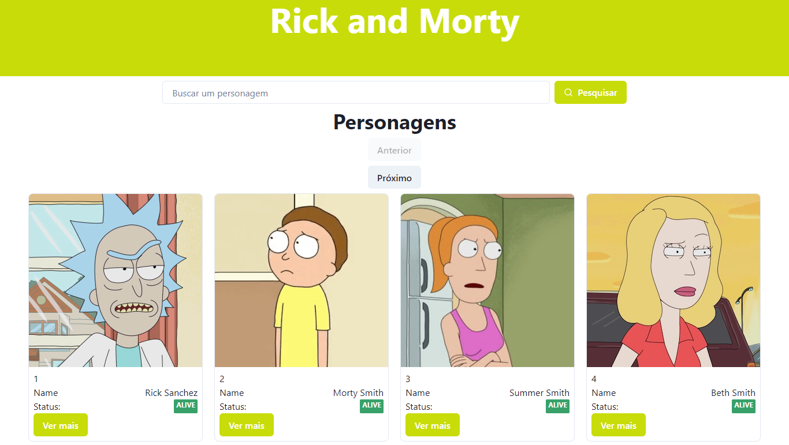
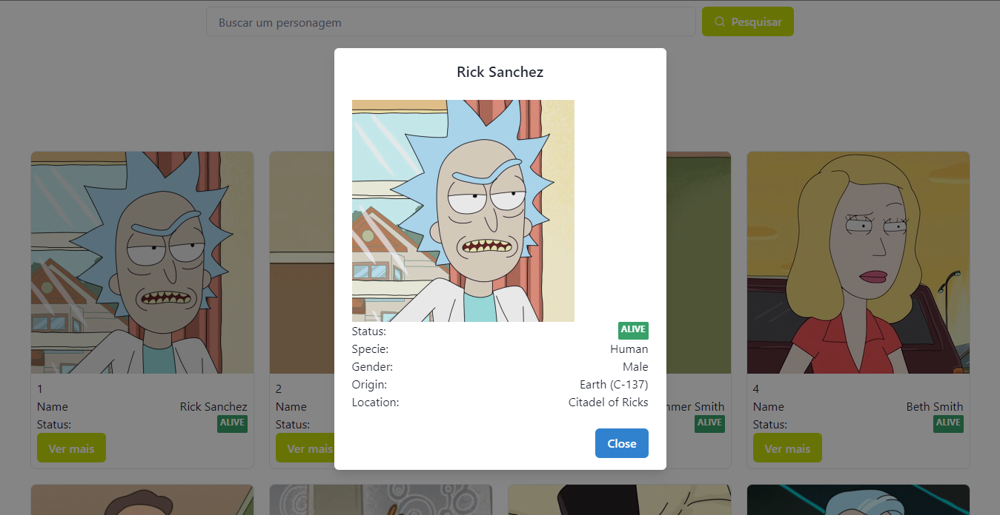

<h1 align="center">"Rick and Morty" Characters's Data</h1>

Esse projeto utiliza a "rickandmortyapi", de onde os dados são recebidos. É possível visualizar uma grade com os personagens, passar páginas para ver mais personagens, pesquisar por um personagem específico e ver um detalhamento de cada personagem.

## Skills
No projeto foram utilizadas as seguintes tecnologias:
- ReactJS: framework front-end.
- Chakra-ui: biblioteca de componentes
- Graphql: linguagem de consulta de dados
- Apollo Client: biblioteca de gerencia de estado utilizada para, entre outras funções, realizar as requisições na API.

## Imagens

## TODO
- modo noturno.
- visualização de localizações e episódios.
  - Mobile: menu lateral
- troca entre visualização de grade e lista.